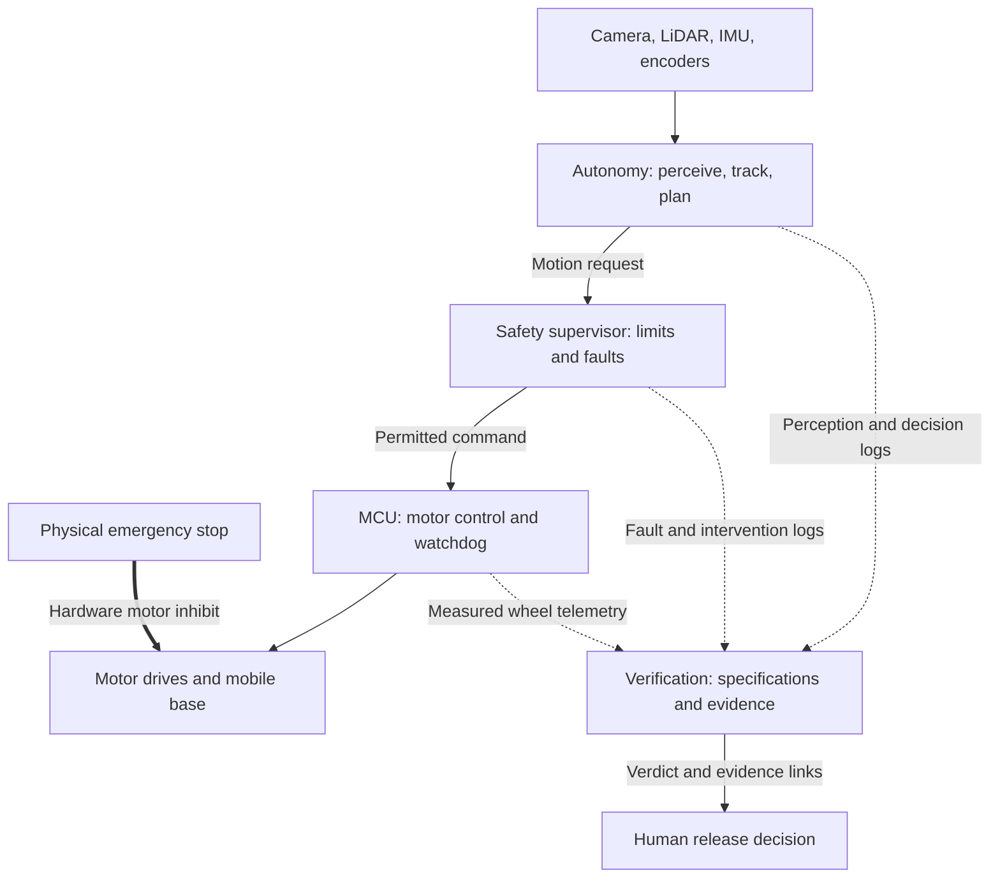

# Open Verified Autonomy

**Build with AI. Verify with evidence.**

We are building an open, low-cost autonomous mobile robot where AI agents can help design and implement the system, but cannot certify their own work. Every autonomous capability must pass predefined tests, adversarial fault injection, and evidence-based independent verification before we call it **VERIFIED**.

Our first application is **verified target following**: a small indoor robot that follows one explicitly selected person, handles uncertainty, and produces evidence showing whether it met its requirements.

> **Current status — Startup scaffold, September 2026.** Architecture and interface drafts, a task roadmap, acceptance/scenario drafts, and experiment templates are now available. Runtime robotics software and hardware validation remain to be implemented. No robot capability or development gate has been verified yet.

**Start with [the first 72 hours](docs/START_HERE.md), [the task backlog](docs/plan/BACKLOG.md), and [current status](docs/plan/STATUS.md).**

## Why we are building this

This is Frank's project for learning AI, robotics, ROS 2, edge computing, and open-source collaboration by building a real system that other people can understand, test, and reproduce.

The goal is to become capable of defining a problem, designing a system, using AI to accelerate implementation, measuring what actually happens, challenging a conclusion, and improving the next experiment. Frank should be able to explain the system and its failures in his own words.

Our central research question is:

> How can we turn requirements, experiments, fault injections, and physical telemetry into independently reviewable decisions about an autonomous system?

The robot is the first experimental platform. The longer-term contribution we want to build is a reusable verification workflow, reference implementation, scenario library, and evidence format for embodied autonomy.

## The first goal: follow the right person, stop when uncertain

Version 0.1 focuses on one complete task in a supervised, low-speed indoor test area:

1. A person deliberately enrolls as the target through an explicit selection action.
2. The robot follows that person at a defined distance and within configured motion limits.
3. Another person crossing the scene must not silently become the new target.
4. Occlusion, ambiguous identity, or stale sensor data triggers the defined slowdown or stop policy. The robot must not continue blind following.
5. Obstacles are avoided within the tested operating envelope, or the robot stops.
6. Sensor failures, software crashes, and lost control communication trigger deterministic protective behavior.
7. Each test produces a traceable evidence bundle and an independently reviewed result.

Person detection is only one component. The task also requires **target enrollment, identity matching, tracking, confidence handling, navigation, and a defined recovery policy**. Resuming after a stop requires the relevant faults to be cleared and the target identity to be confirmed according to that policy.

The initial platform is a differential-drive robot. Delivery services, smart luggage, outdoor operation, and learned end-to-end control are future possibilities; they are outside the v0.1 scope.

## Three planes, three responsibilities

| Plane | Question it answers | Planned responsibilities |
| --- | --- | --- |
| **Autonomy** | What should the robot do? | Perception, target identity, tracking, mapping, localization, planning, and motion requests. |
| **Safety** | Is this motion permitted right now? | Deterministic limits, sensor freshness checks, fault states, command timeouts, MCU watchdog behavior, and physical emergency stop. |
| **Verification** | What evidence supports the claim? | Acceptance specifications, scenario execution, fault injection, evidence collection, independent verdicts, and release review. |



The diagram shows the intended authority boundaries. The physical emergency stop must directly affect the drive hardware; its effectiveness must not depend on a ROS 2 node or a generative AI response. The exact electrical stop path will be documented and tested with the chosen chassis.

The verification plane can run on a development computer or in CI. It evaluates requirements and evidence before and after experiments. Runtime motion protection belongs to the deterministic safety plane. **An AI verdict cannot override a stop or authorize motor commands.**

## Initial hardware and software direction

| Component | Initial direction | What must be checked |
| --- | --- | --- |
| Main computer | RK3588 single-board computer with adequate cooling and storage | Board image, ARM64 drivers, sustained inference latency, temperature, and power behavior. |
| Mobile base | Mature differential-drive chassis with encoders and an independent MCU | Open command/telemetry protocol, odometry, watchdog behavior, and access to the hardware stop path. |
| Sensors | 2D LiDAR, USB UVC RGB camera, wheel encoders, and IMU | Driver support, timestamps, calibration, and failure detection. |
| Power | Suitable finished battery pack, BMS, charger, and regulated supplies | Compatibility with the base, computer, and sensors under load. |
| Robotics software | ROS 2, SLAM Toolbox, and Nav2 | A documented, reproducible combination of OS, packages, drivers, and configuration. |
| Edge inference | Rockchip RKNN toolchain and a compact perception model | Model conversion, accuracy changes, end-to-end latency, and thermal behavior. |

**RK3588 is the initial compute direction and a replaceable backend.** The autonomy interfaces and verification protocol should survive a change of board or inference engine. We will choose the exact board, sensors, MCU, and software versions after compatibility checks.

Start with available modules, including suitable open-protocol chassis sold on Taobao. Ask vendors for source links, licenses, ROS 2 examples, URDF/TF documentation, encoder data, and the actual watchdog behavior. Check whether the chassis can be purchased without a bundled main computer. Custom control boards can follow once the platform and product requirements are understood.

## What “verified” means here

Verification is a claim about a **specific capability, version, configuration, and set of test conditions**. It is not a blanket guarantee, formal proof, or safety certification.

Our planned workflow is:

1. **Define intent and boundaries.** State the task, environment, permitted behavior, and failure response.
2. **Freeze acceptance criteria.** Specify measurements and PASS/FAIL conditions before implementation and testing. Version later changes explicitly.
3. **Build and review.** Humans and AI agents implement the feature; a reviewer challenges the design and code.
4. **Test and attack.** Use simulation and replay, then physical experiments and deliberate fault injection.
5. **Collect evidence.** Preserve raw observations, configurations, timestamps, and calculated metrics, including failed runs.
6. **Verify independently.** A verifier checks the frozen criteria against the evidence and reports gaps and counterexamples.
7. **Make a release decision.** A human reviews the verdict and decides whether the development gate is complete.

Builder and verifier are separate roles. The verifier reviews without changing the implementation or weakening the criteria to make it pass. An AI review is useful support; it does not replace raw evidence or independent human review.

Individual tests report `PASS` or `FAIL`; unexecuted or inconclusive tests remain explicitly unresolved. Gate verdicts are `VERIFIED`, `NOT VERIFIED`, or `PARTIAL`. Missing evidence cannot produce a pass, and `PARTIAL` does not complete a gate.

### Evidence for every experiment

Each planned experiment directory will contain:

| File | Purpose |
| --- | --- |
| `run.yaml` | Run ID, hardware, software commit, configuration, model hashes, and test conditions. |
| `acceptance.yaml` | The versioned criteria used for this run. |
| `events.csv` | Timestamped events, interventions, faults, and injected failures. |
| `metrics.json` | Calculated metrics and the method or script used to obtain them. |
| `evidence_index.md` | Locations and hashes of raw rosbag2 recordings, video, and logs. |
| `verifier_report.md` | Independent results, evidence references, limitations, and unresolved findings. |
| `decision.md` | Human decision on whether the gate may advance. |

Large recordings can live outside Git, with retrievable locations and integrity hashes in the repository. A stop command alone does not prove the robot stopped: wheel telemetry and physical observations must support the stopping result.

## Progress through evidence gates

All gates below are **planned and uncompleted**. Progress depends on evidence, not the calendar.

| Gate | Capability | Required output |
| --- | --- | --- |
| **G0 — Architecture** | Define the three planes, interfaces, hardware shortlist, and acceptance drafts. | Architecture document, BOM, stop-path design, and versioned test specifications. |
| **G1 — Manual robot** | Teleoperation, encoder feedback, emergency stop, and watchdog behavior. | Repeatable manual-control and fault-stop tests with video and motor logs. |
| **G2 — Navigation** | LiDAR, mapping, localization, and point-to-point Nav2 operation. | A 20-run navigation report with outcomes, interventions, logs, and compliance with predefined criteria. |
| **G3 — Edge AI** | Perception on the initial RK3588 backend. | Model/version record and measured latency, FPS, accuracy, and temperature under sustained load. |
| **G4 — Target identity** | Enrollment and tracking of the selected person in a multi-person scene. | Identity-switch results, confidence traces, and annotated video. |
| **G5 — Following** | Integrated following, obstacle handling, and uncertainty policy. | Evidence for scenarios S01–S09. |
| **G6 — Fault injection** | Protective behavior during sensor, node, and communication failures. | Evidence for S10–S12 plus MCU-link loss and stale-data tests. |
| **G7 — Independent verification** | A reviewer other than the feature author reproduces the verdict. | Evidence-linked verdict with every mandatory criterion resolved. |
| **G8 — External reproduction** | Another person reproduces the core demo from a documented revision. | Independent build log, pinned dependencies, and repeatable test results. |

A 20-run result describes those documented trials; it does not establish reliability in every environment. If a gate fails, investigate, change the system, and rerun the relevant tests while retaining the previous evidence.

### Core test scenarios

| ID | Scenario | Main question |
| --- | --- | --- |
| S01 | One person, normal following | Does the baseline meet the defined distance and motion criteria? |
| S02 | A second person crosses | Does the robot retain the enrolled target? |
| S03 | Similar-looking people | Does identity ambiguity trigger the required response? |
| S04 | Short occlusion | Is recovery consistent with the confidence and motion policy? |
| S05 | Long occlusion | Does the robot stop instead of continuing blind following? |
| S06 | Target turns quickly | Does control remain within the defined limits? |
| S07 | Low light or backlighting | Is degraded perception detected and handled? |
| S08 | A static obstacle appears | Does the robot avoid it or stop within the tested envelope? |
| S09 | A moving obstacle crosses | Does the robot respond within the defined clearance limits? |
| S10 | Camera disconnects | Is the fault detected and physical stopping measured? |
| S11 | LiDAR data times out | Does the system enter the required fault state? |
| S12 | A high-level node crashes | Do the supervisor and command-timeout path prevent continued motion? |

Before these tests, define numerical limits for speed, acceleration, following distance, identity confidence, data freshness, and physical stopping time and distance. Fix repetition counts and measurement methods in the acceptance specification. Also test the verifier itself: incomplete logs, a mismatched commit, or insufficient trials must not receive `VERIFIED`.

## Start here

The next deliverable is **G0**, followed by a measurable G1 manual robot.

1. Follow [the first 72 hours](docs/START_HERE.md) and confirm [team responsibilities](docs/plan/TEAM.md).
2. Review the drafted [architecture](docs/architecture/three-plane-v0.1.md) and [interfaces](docs/architecture/interfaces-v0.1.md).
3. Use [the hardware checklist](hardware/supplier-checklist.md) to compare real suppliers and resolve compatibility.
4. Complete the drafted [G1](verification/specs/G1-manual-robot.yaml) and [G2](verification/specs/G2-navigation.yaml) criteria.
5. Use [the experiment templates](experiments/README.md) to rehearse evidence capture.
6. Work through [the backlog](docs/plan/BACKLOG.md) and [GitHub Issues](https://github.com/frank2023fantastic/Open-Verified-Autonomy/issues).

The record-creation helper is available with Python 3.9+:

```bash
python3 tools/new_experiment.py --run-id practice-001 --gate G1 --mode dry_run
```

This creates an empty, labeled record. It does not execute a robot test or issue a verdict.
Robot installation and launch commands will be added with a working implementation.

### Repository layout

The directories below contain starting documents and templates. Runtime modules are not implemented yet.

| Path | Contents |
| --- | --- |
| [docs/](docs/START_HERE.md) | Startup guide, team, roadmap, task backlog, and current status. |
| [docs/architecture/](docs/architecture/three-plane-v0.1.md) | Three planes, interface contract, and decision-record template. |
| [hardware/](hardware/README.md) | BOM, supplier comparison, selection, and bringup checklists. |
| [firmware/](firmware/README.md) | MCU integration responsibilities and first deliverables. |
| [ros2_ws/src/](ros2_ws/src/README.md) | Planned package responsibilities and integration sequence. |
| [ai/](ai/README.md) | Edge perception work plan and model metadata template. |
| [verification/](verification/README.md) | G0–G8 draft specs, S01–S12 scenarios, review protocol, and evidence indexes. |
| [experiments/](experiments/README.md) | Seven-file record template and experiment instructions. |
| [tools/](tools/README.md) | Experiment-record creation utility. |
| [third_party/](third_party/README.md) | Upstream integration and license register. |
| [media/](media/README.md) | Evidence-linked build-log instructions. |

Read [CONTRIBUTING](CONTRIBUTING.md) for task handoffs and the coordinated main-branch workflow.

## Learn from and contribute to open source

Use existing projects as documented building blocks. For every integration, record **what upstream provides, what we changed, and what we verified**.

| Resource | Intended use |
| --- | --- |
| [Nav2](https://docs.nav2.org/) | ROS 2 navigation concepts, robot setup, planning, and control. |
| [SLAM Toolbox](https://github.com/SteveMacenski/slam_toolbox) | 2D mapping and localization. |
| [RKNN-Toolkit2](https://github.com/airockchip/rknn-toolkit2) | Rockchip model conversion and deployment tooling. |
| [RKNN Model Zoo](https://github.com/airockchip/rknn_model_zoo) | Model deployment examples and benchmark starting points. |
| [OpenBot](https://www.openbot.org/) | A reference for low-cost mobile autonomy and person following. |

These are reference resources, not a claim that their integration has been tested here. Pin compatible versions as part of implementation and preserve upstream license obligations. The project license is still to be selected and added.

Frank will lead the project direction, perception and identity work, repository, and English build logs. Robotics and testing collaborators can lead chassis integration, navigation, scenario design, and physical experiments. Mentors review architecture and evidence; AI agents assist with planning, implementation, review, and finding counterexamples.

Contributions can be code, a reproducible failure, a test scenario, a measurement, clearer documentation, or an independent reproduction. Publish failures as well as successes, and connect every demo to its commit and evidence.

## Longer-term direction

After the core demo is independently reproduced, test whether people find a following load-carrying prototype useful. Use those observations to choose a product direction and decide whether custom hardware is justified.

The research should also measure whether separating builders from verifiers helps catch missed defects, how identity confidence should influence stop behavior, which fault injections reveal important failures, and how easily another team can reproduce the evidence.

**Our goal is to build, understand, challenge, and openly reproduce a real autonomous system—one evidence-backed capability at a time.**
