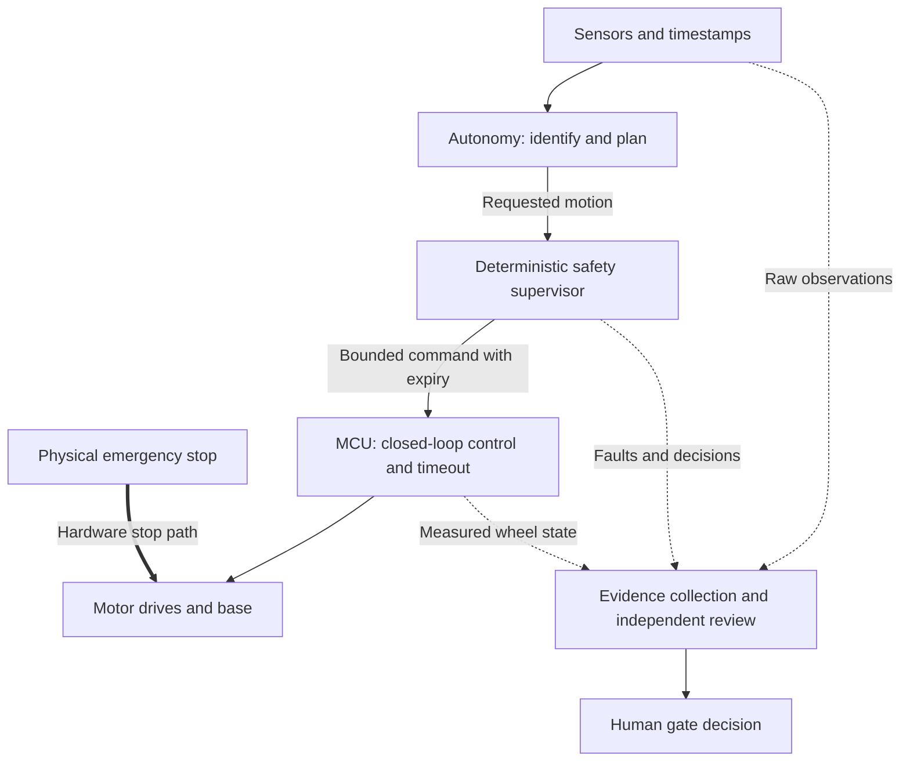

# Three-plane architecture v0.1

Status: DRAFT FOR G0 REVIEW. This expands the published mission; it is not a tested implementation.
Scope: one enrolled-target following task on a supervised, low-speed indoor differential-drive robot.

## Authority and execution

| Plane | Execution location | Owns | Must not do |
| --- | --- | --- | --- |
| Autonomy | Initial RK3588 / development computer | Perception, target identity, localization, plans, requested velocity | Bypass the supervisor or drive motors directly. |
| Safety | Deterministic supervisor plus independent MCU and stop circuitry | Motion limits, freshness/fault policy, command expiry, protective stop | Depend on a generative model or cloud reply for a stop. |
| Verification | Development computer, test runner, or later CI | Criteria, scenarios, evidence checks, release findings | Treat a model's confidence or its own prose as physical evidence. |

The electrical stop design must be verified on the actual drive system. Motor inhibit can produce coast
or braking depending on the hardware; neither a diagram nor a zero command establishes stopping distance.

## Intended motion states

| State | Entry | Motion policy | Recovery |
| --- | --- | --- | --- |
| DISARMED | Startup or completed stop/reset sequence | Motion disabled | Explicit arm request after required checks. |
| MANUAL | Arm checks pass; active manual control | Bounded teleoperation, same stop authority as autonomy | Stop or explicit mode transition. |
| FOLLOW | Valid enrolled identity; required data and navigation healthy | Bounded follow requests through the supervisor | Fault/uncertainty withdraws motion permission. |
| STOPPED | Target uncertainty or a recoverable condition requires a stop | No blind forward following | Clear condition, recheck identity, and apply the documented resume rule. |
| FAULT | Required data stale, command expiry, MCU fault, or inconsistent state | Defined protective stop; remain stopped | Clear fault and explicitly rearm after checks. |
| ESTOP | Physical emergency stop asserted | Hardware stop path has priority | Release stop, inspect the situation, and explicitly rearm; no automatic restart. |

Exact state implementation, thresholds, allowed transitions, and braking behavior are G0/G1 design work.
Initial target-loss behavior is stop; any moving search behavior requires its own specification and evidence.

## Failure boundaries

- A high-level process crash must not leave a live last-speed command indefinitely.
- The MCU must expire missing/invalid commands independently of Linux and ROS 2.
- Camera/LiDAR freshness must use observations of data age, not only process liveness.
- A runtime monitor failure must cause downstream command permission to expire.
- Identity ambiguity must not silently enroll a distractor.
- Missing evidence, configuration mismatch, or insufficient trials prevents a verified verdict.

## Decisions still open

Exact board and OS; MCU/drive hardware; transport and packet format; distance measurement; stopping
method and limits; sensor timestamp alignment; target-enrollment method; project license.
Resolve these through [interfaces](interfaces-v0.1.md), [hardware selection](../../hardware/selection.md),
and [decision records](decisions/README.md).
