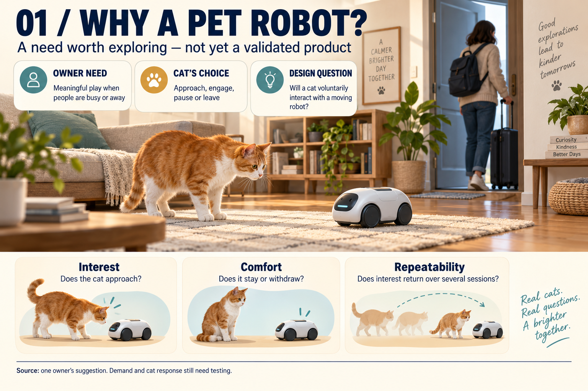
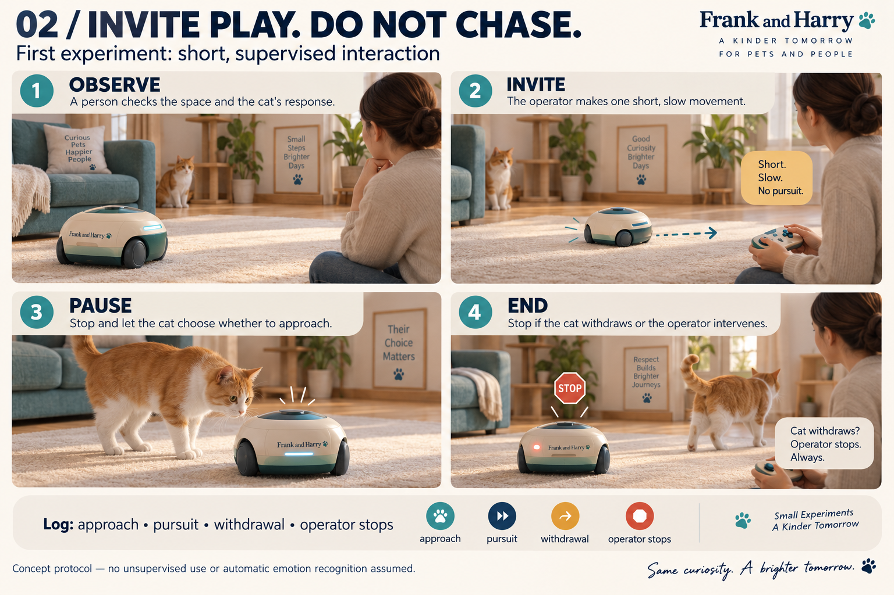
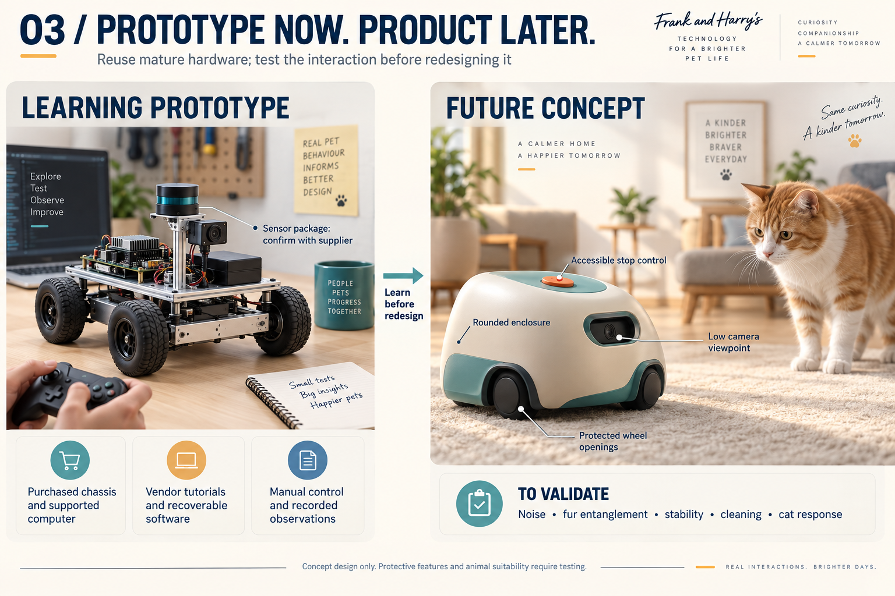
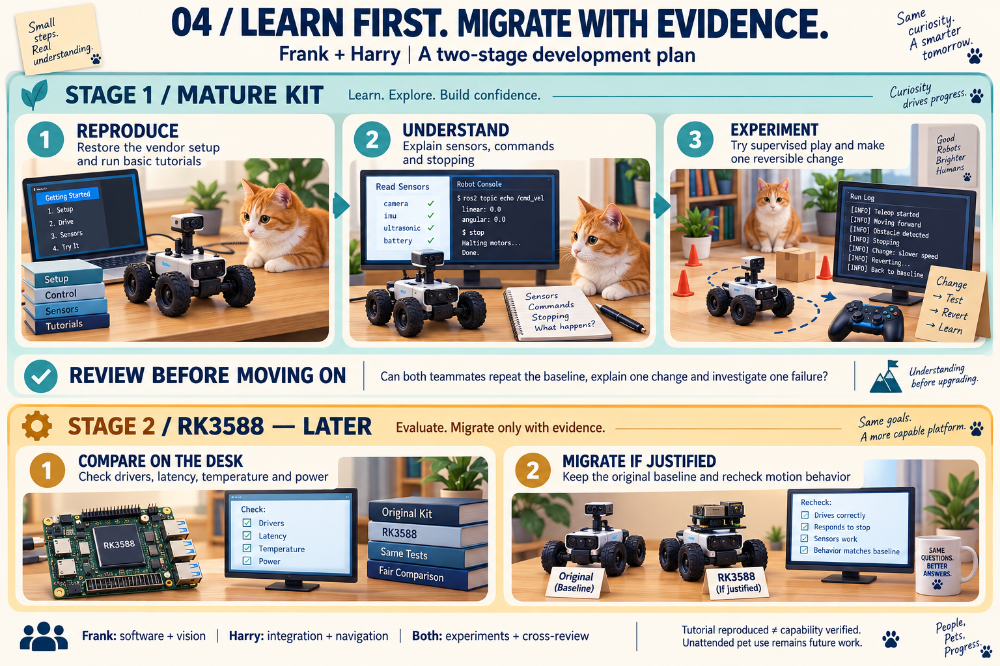
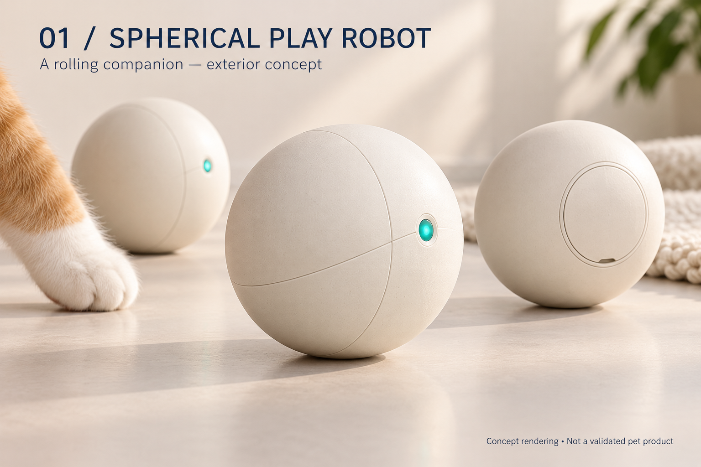
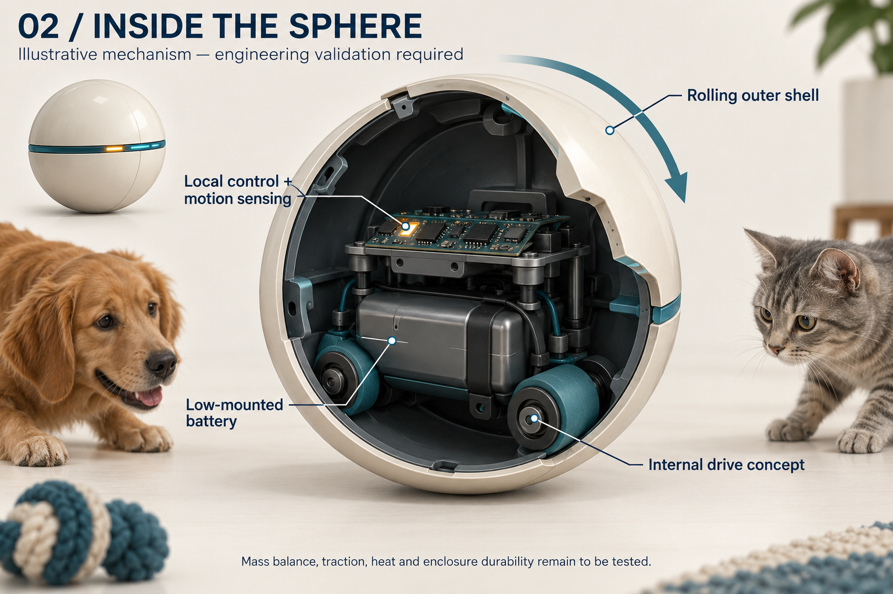
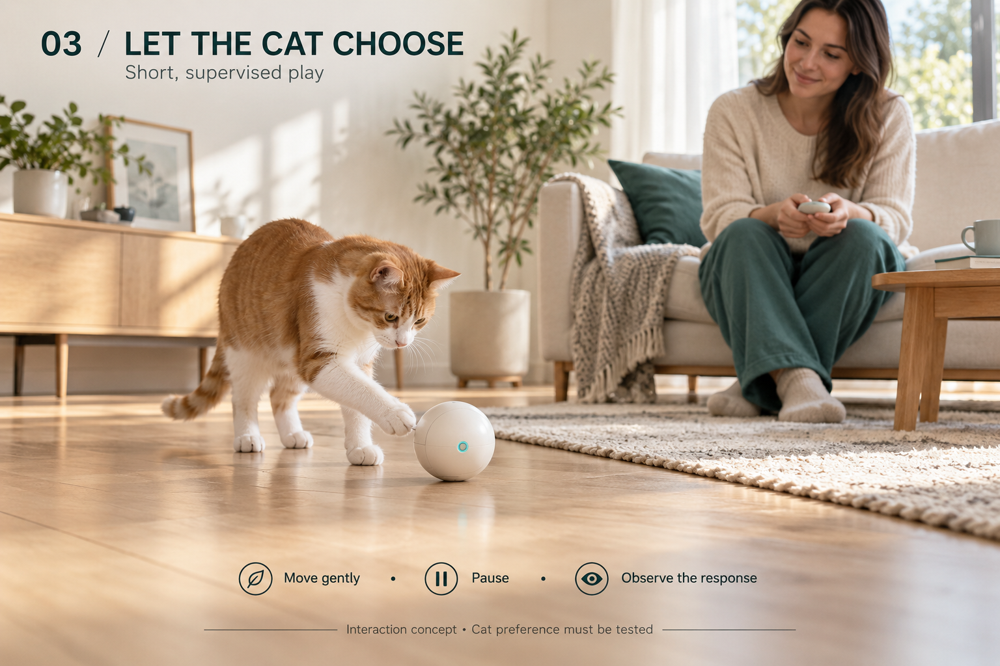
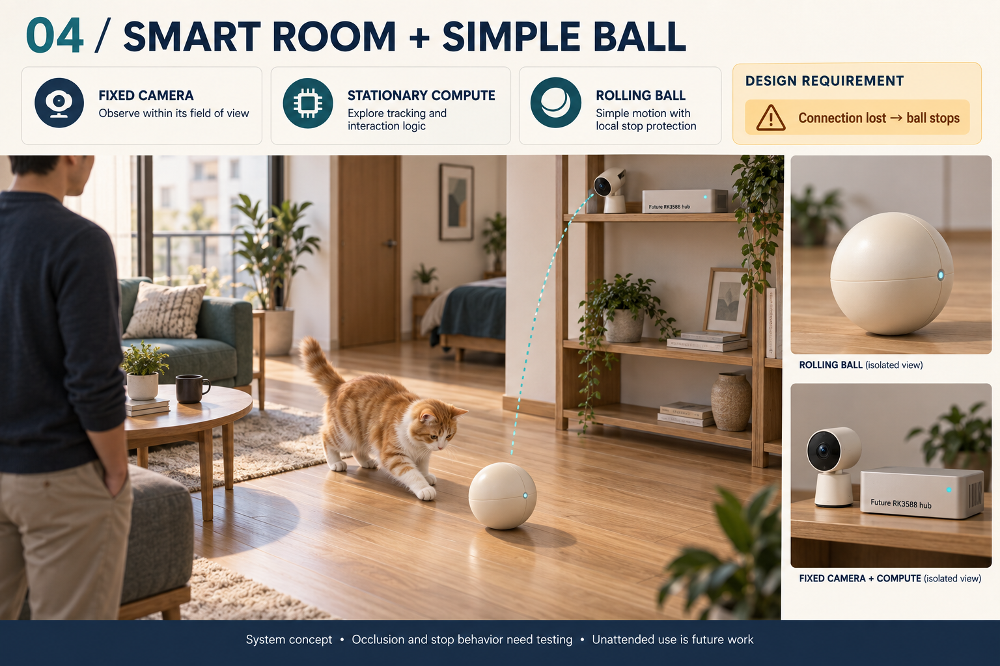

# Pet robot exploration: discussion and visual assets

Date: 2026-09-06. **EXPLORATORY — no product, purchase or capability verification.**

This archive preserves the route from mature-kit learning to a pet-interaction idea, Koala's
spherical-form suggestion, and two groups of four English concept images.
Harry's mother supplied the initial need signal through Frank; Koala is the sponsor's wife
and supplied the ball-shape hypothesis. These are separate contributions.

## Read the process

- [Discussion and decision history](DISCUSSION.md)
- [Needs, form factors and architecture hypotheses](DESIGN.md)
- [First supervised experiments to discuss](EXPERIMENTS.md)
- [Sources and visual limitations](SOURCES.md)
- [Generation requests](generation-requests.json)
- [File integrity manifest](asset-manifest.json)
- [Current two-stage project plan](../../../docs/plan/TWO_STAGE_PLAN.md)

The L150 Pro four-wheel-drive package is a team-reported candidate; its full ROS 2 package
remains unconfirmed. A spherical product is not a new custom-hardware task.
Pet interaction is an exploration track; the existing v0.1 mission and G0–G8 gates are unchanged.

## Concept gallery

All eight pictures below are AI-generated concept illustrations. They are not test evidence.
The screen output, hardware layouts and protective features depicted are illustrative.

### 1. Pet needs and hypotheses

### 2. Supervised interaction storyboard

### 3. Learning prototype and future enclosure

### 4. Mature-kit learning and later RK3588

### 5. Spherical exterior concept

### 6. Illustrative internal rolling mechanism

### 7. Supervised cat and ball interaction

### 8. Fixed camera, stationary compute and rolling ball

## Reference archive

The [17 supplied seller images](SOURCES.md#user-supplied-seller-references) retain the original
Chinese text and original files. New discussion documents and generated posters are in English.
The group-chat content is preserved as a paraphrased record rather than exposing the chat UI.

## Team discussion

Use [Issue #3](https://github.com/frank2023fantastic/Open-Verified-Autonomy/issues/3) for the complete-kit
question and [Issue #8](https://github.com/frank2023fantastic/Open-Verified-Autonomy/issues/8) for the
learning experiment and possible pet application. Suggested roles remain Frank on software/vision,
Harry on integration/navigation, both on experiments and cross-review.
